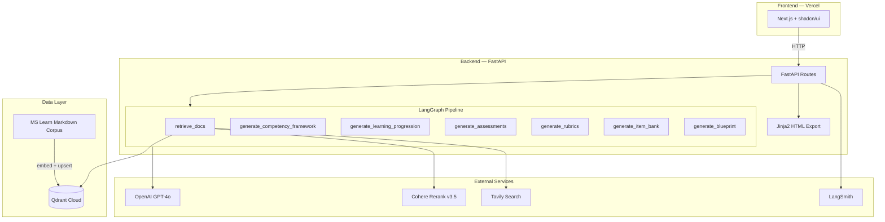
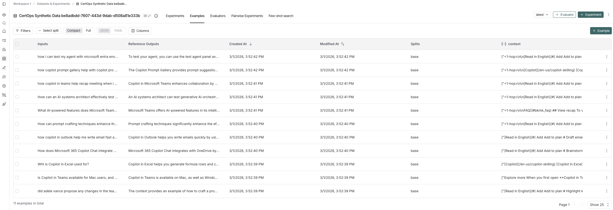
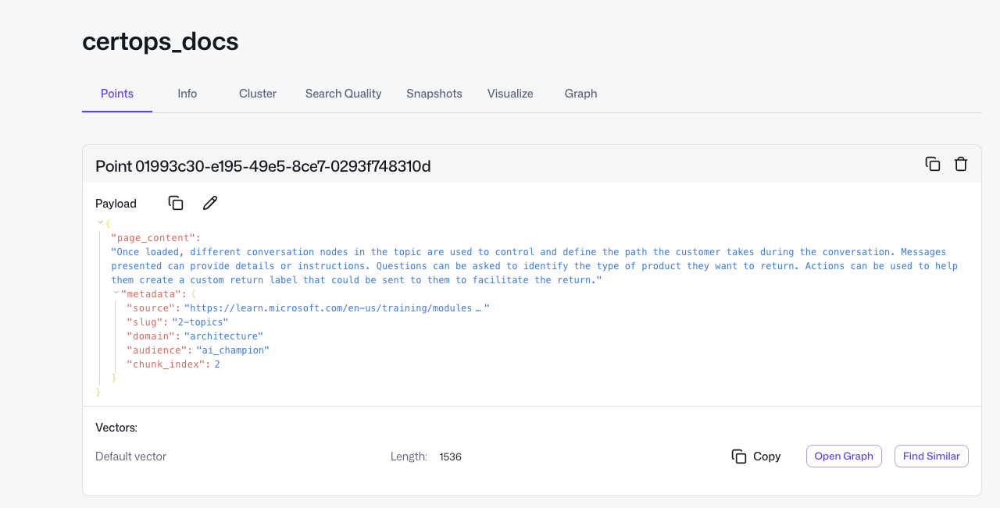

# CertOps

**AI-Native Certification Builder for Enterprise AI Platforms**

CertOps is an LLM-powered system that ingests platform documentation, retrieves relevant content via RAG, and generates production-ready certification artifacts — competency frameworks, learning progressions, performance-based assessments, scoring rubrics, item banks, and certification blueprints.

**[Live Demo](https://frontend-hms3cgfqe-josephs-projects-8536c5c0.vercel.app)** | **[API Health Check](https://certops.onrender.com/health)**

> Note: The backend runs on Render's free tier and may take ~30 seconds to wake up on first request.

---

## The Problem

Enterprise AI platforms like Microsoft 365 Copilot and Copilot Studio evolve faster than organizations can build and maintain rigorous certifications for them. When your company rolls out M365 Copilot to thousands of employees, someone has to certify that those people can actually use it — not just pass a multiple-choice quiz, but demonstrate real competence in context.

Today, that work falls on Certification Architects and AI Enablement Leaders who manually author competency frameworks, design scenario-based assessments, write scoring rubrics, and maintain item banks. Every time the platform ships an update (and Copilot Studio ships updates monthly), the entire certification must be reviewed, rewritten, and revalidated. This is a labor-intensive, expert-driven process that does not scale.

The result is a painful tradeoff: certifications become either **shallow** (multiple-choice recall questions that don't measure real competence) or **stale** (rigorous but outdated within weeks). Neither outcome serves the organization. CertOps addresses this by using retrieval-augmented generation to keep certification content grounded in current documentation, and structured LLM output to generate the artifacts that currently require weeks of expert labor.

## The Solution

CertOps is an agentic RAG application built with LangGraph. The user selects a certification track through a Next.js dashboard, and the system runs a multi-step pipeline:

1. **Retrieve** relevant documentation chunks from Qdrant (Cohere-reranked)
2. **Augment** with Tavily web search for the latest platform updates
3. **Generate** each certification artifact in sequence — framework first (so downstream artifacts can reference it), then learning progression, assessments, rubrics, item bank, and a certification blueprint

Every LLM call uses OpenAI GPT-4o with structured output (Pydantic models) to ensure artifacts are valid and exportable. The final output is a comprehensive, styled HTML certification report that a non-technical user can download and hand to stakeholders.

## Architecture



## Tech Stack

| Component | Choice | Why |
|-----------|--------|-----|
| **LLM** | OpenAI GPT-4o | Best-in-class structured output via `with_structured_output()` |
| **Orchestration** | LangGraph | Stateful graph maps directly to a multi-step pipeline where each node depends on the previous |
| **Embeddings** | OpenAI text-embedding-3-small | High quality at low cost; 1536-dim vectors |
| **Vector DB** | Qdrant Cloud | Production-grade managed vector DB with metadata filtering |
| **Retriever** | Cohere Rerank v3.5 | Winner from RAGAS evaluation — retrieve top 20, rerank to top 5 |
| **Search Tool** | Tavily | Purpose-built for AI apps; fetches latest platform updates not in the local corpus |
| **Monitoring** | LangSmith | Full tracing of every LLM call, retrieval, and tool use |
| **Evaluation** | RAGAS | Measures faithfulness, context precision, and context recall |
| **Frontend** | Next.js + Tailwind + shadcn/ui + Motion | Polished dashboard with animated pipeline progress |
| **Backend** | FastAPI + Jinja2 | Python API with HTML report rendering |
| **Deployment** | Vercel (frontend) + FastAPI (backend) | Vercel handles CDN/edge; FastAPI invokes the LangGraph workflow |
| **Dependencies** | uv | Fast, reproducible Python dependency management |

## Certification Tracks

CertOps currently supports two tracks built from a curated corpus of 45 Microsoft Learn training module pages:

**AI Champion** — For professionals building AI agents with Copilot Studio. Covers agent creation, conversational design, connector integration, security, and governance.

**M365 Copilot User** — For everyday users leveraging Copilot across Word, Excel, PowerPoint, Teams, and Outlook. Covers productivity workflows, communication, and prompt engineering.

## What It Generates

Each pipeline run produces six structured artifacts:

| Artifact | Description |
|----------|-------------|
| **Competency Framework** | Domains, skills, and proficiency levels (novice / competent / expert) with behavioral indicators |
| **Learning Progression** | Ordered learning objectives with suggested activities, estimated hours, and success criteria |
| **Assessment Tasks** | Scenario-based performance assessments with instructions, expected outputs, and evaluator guides |
| **Scoring Rubrics** | Weighted criteria with multi-level descriptors for consistent grading |
| **Item Bank** | Reusable assessment items (performance, scenario, analysis) with model answers and scoring notes |
| **Certification Blueprint** | Executive summary tying all artifacts together — program overview, assessment strategy, estimated duration |

All artifacts are delivered as a single downloadable HTML report styled for print and screen.

## Portfolio Notebooks

The `notebooks/` directory contains three notebooks that walk through the full engineering process:

| Notebook | What It Covers |
|----------|---------------|
| **01_data_pipeline** | Document scraping from Microsoft Learn, chunking with `RecursiveCharacterTextSplitter`, embedding with `text-embedding-3-small`, upserting to Qdrant with domain/audience metadata |
| **02_retrieval_evaluation** | Synthetic test set generation (RAGAS SDG), baseline retriever evaluation, Cohere reranker, domain-filtered retriever, full RAGAS comparison table |
| **03_certification_engine** | Pydantic schemas, LangGraph node definitions, complete `StateGraph` pipeline, end-to-end runs for both tracks |

## Quickstart

### Prerequisites

- Python 3.11+ with [uv](https://docs.astral.sh/uv/)
- Node.js 18+
- API keys: OpenAI, Qdrant Cloud, Cohere, Tavily, LangSmith

### Backend

```bash
# Install Python dependencies
uv sync

# Configure environment
cp .env.example .env
# Fill in your API keys in .env

# Start the FastAPI server
uv run uvicorn backend.main:app --reload --port 8000
```

### Frontend

```bash
cd frontend

# Install Node dependencies
npm install

# Start the dev server
npm run dev
```

Open [http://localhost:3000](http://localhost:3000), select a certification track, and click **Generate Certification**.

### Running the Notebooks

```bash
# Launch Jupyter
uv run jupyter notebook

# Open notebooks/ and run 01 → 02 → 03 in order
```

## Deployment

| Service | Platform | URL |
|---------|----------|-----|
| **Frontend** | Vercel | [certops on Vercel](https://frontend-hms3cgfqe-josephs-projects-8536c5c0.vercel.app) |
| **Backend** | Render | [certops.onrender.com](https://certops.onrender.com) |
| **Vector DB** | Qdrant Cloud | Collection `certops_docs` with payload indexes on `metadata.domain` and `metadata.audience` |

The frontend auto-deploys from the `main` branch via Vercel. The backend auto-deploys via Render using the project's `Dockerfile`.

## Screenshots

### LangSmith Tracing


### Qdrant Collection


## Project Structure

```
CertOps/
├── backend/                  # FastAPI application
│   ├── graph.py              # LangGraph pipeline (7 nodes)
│   ├── main.py               # API endpoints + HTML export
│   ├── schemas.py            # Pydantic models for all artifacts
│   └── templates/
│       └── certification_report.html
├── data/
│   ├── certops_ai_champion_output.json
│   ├── certops_user_output.json
│   ├── synthetic_testset.csv
│   └── docs/                 # Scraped Microsoft Learn markdown
├── frontend/                 # Next.js dashboard
│   ├── src/app/              # Pages (home, generate)
│   ├── src/components/       # UI components
│   └── src/lib/              # Types, API client, utils
├── notebooks/
│   ├── 01_data_pipeline.ipynb
│   ├── 02_retrieval_evaluation.ipynb
│   └── 03_certification_engine.ipynb
├── Dockerfile
├── docker-compose.yml        # Local Qdrant
├── pyproject.toml
└── uv.lock
```

## Future Work

- **Adaptive assessment engine**: Build a second LangGraph that delivers assessments to learners in real time. The system would select items from the generated item bank based on the learner's current estimated proficiency, evaluate free-text responses against the rubrics and model answers using LLM-as-judge, and adapt the next question based on performance. Session state would be managed with a LangGraph checkpointer; long-term learner profiles would persist in a LangGraph Store keyed by user ID, enabling the system to pick up where a learner left off across sessions. All the structured artifacts the pipeline already generates (item bank with model answers, rubrics with weighted criteria, proficiency levels with behavioral indicators) serve as the evaluation backbone.
- **Conversational refinement**: Add checkpointing to the content generation pipeline so a certification architect can iteratively refine artifacts through conversation (e.g., "Add a third skill to the security domain" or "Make that assessment harder") rather than regenerating from scratch.
- **Additional certification tracks**: Expand beyond M365 to cover Power Platform, Azure AI, and other enterprise AI platforms.
- **PDF export**: Extend the HTML report to include formatted PDF output for integration with LMS platforms.
- **LangSmith retriever comparison**: Run all four retriever strategies through LangSmith's evaluation UI for side-by-side visual comparison.
