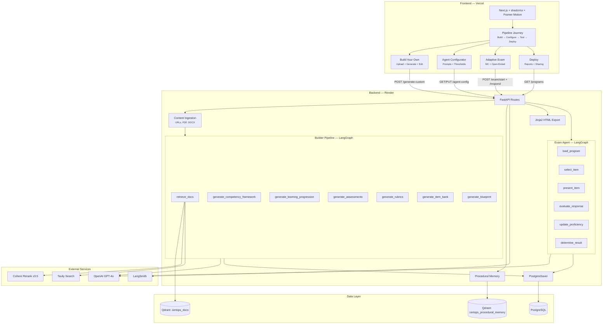
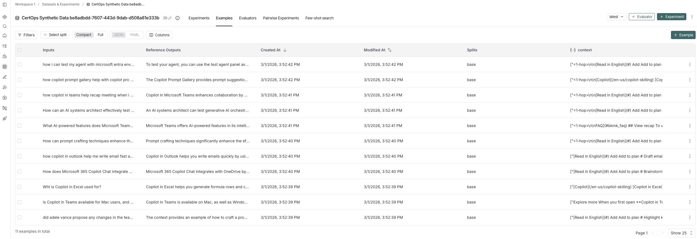
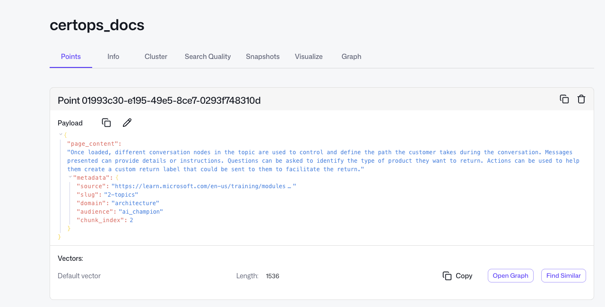

# CertOps

**AI-Native Certification Builder for Enterprise AI Platforms**

CertOps is an LLM-powered system that ingests platform documentation (or user-provided content), retrieves relevant material via RAG, and generates production-ready certification artifacts — competency frameworks, learning progressions, performance-based assessments, scoring rubrics, item banks with multiple choice and open-ended questions, and certification blueprints. A second LangGraph agent delivers adaptive exams with per-user customizable behavior through procedural memory.

**[Live Demo](https://certops.vercel.app)** | **[Loom Video](https://www.loom.com/share/e1309d309c5940098a2b80b2c843170a)**

---

## The Problem

Enterprise AI adoption efforts struggle to create up-to-date, role-specific, competency-based learning paths because official documentation is fragmented, rapidly evolving, and difficult to operationalize into structured certification programs.

As a Senior AI Enablement Manager, I am responsible for driving Microsoft 365 Copilot adoption across the organization. However, Microsoft's official learning materials and technical documentation are distributed across multiple sources, including documentation hubs, training paths, blog posts, and release notes. This fragmentation makes it difficult to determine which content is current, authoritative, and aligned with our governance standards.

At the same time, we need differentiated AI fluency tracks for everyday users, AI champions, and technical builders. Existing certifications and learning paths are either too generic or quickly become outdated as the product evolves. This leads to inconsistent adoption, unclear competency benchmarks, and significant manual effort to maintain enablement programs. We need a structured, AI-native system that transforms curated documentation into dynamic learning paths and competency-based assessments tailored to our organization.

## The Solution

CertOps is an agentic RAG application built with LangGraph. The home page presents a four-step pipeline journey:

1. **Build** — Upload URLs, PDFs, or DOCX files and CertOps generates a complete certification package from your content. Edit any artifact with form-based editors and LangGraph replays downstream artifacts automatically (Express Mode).
2. **Configure** — Customize the exam agent's evaluation style, scoring thresholds, and messaging through procedural memory stored in Qdrant with per-user namespaces.
3. **Test** — Take an adaptive exam powered by a second LangGraph agent. It delivers a mix of multiple choice and open-ended questions, scores responses deterministically or via LLM-as-judge, and presents a comprehensive question-by-question review with feedback and source links at the end.
4. **Deploy** — Browse saved programs, view and download HTML certification reports, and share exams via direct links or embeddable snippets.

Additional modes include **Explore Exemplar** for browsing pre-built certifications (AI Champion, M365 Copilot User) with an interactive guided tour.

The generation pipeline:

1. **Retrieve** relevant documentation chunks from Qdrant (Cohere-reranked) or ingest user-provided content (URLs, PDF, DOCX)
2. **Augment** with Tavily web search for the latest platform updates
3. **Generate** each certification artifact in sequence — framework first (so downstream artifacts can reference it), then learning progression, assessments, rubrics, item bank, and certification blueprint

Every LLM call uses OpenAI GPT-4o with structured output (Pydantic models) to ensure artifacts are valid and exportable. The final output is a comprehensive, styled HTML certification report that a non-technical user can download and hand to stakeholders.

## Architecture


```mermaid
flowchart TB
    subgraph frontend ["Frontend — Vercel"]
        NextJS["Next.js + shadcn/ui + Framer Motion"]
        Pipeline["Pipeline Journey<br/><small>Build → Configure → Test → Deploy</small>"]
        Build["Build Your Own<br/><small>Upload + Generate + Edit</small>"]
        Configure["Agent Configurator<br/><small>Prompts + Thresholds</small>"]
        Assess["Adaptive Exam<br/><small>MC + Open-Ended</small>"]
        Deploy["Deploy<br/><small>Reports + Sharing</small>"]
    end

    subgraph backend ["Backend — Render"]
        API["FastAPI Routes"]
        Ingest["Content Ingestion<br/><small>URLs, PDF, DOCX</small>"]
        subgraph builderPipeline ["Builder Pipeline — LangGraph"]
            Retrieve["retrieve_docs"]
            Framework["generate_competency_framework"]
            Progression["generate_learning_progression"]
            Assessments["generate_assessments"]
            Rubrics["generate_rubrics"]
            ItemBank["generate_item_bank"]
            Blueprint["generate_blueprint"]
        end
        subgraph examAgent ["Exam Agent — LangGraph"]
            LoadProgram["load_program"]
            SelectItem["select_item"]
            PresentItem["present_item"]
            EvalResponse["evaluate_response"]
            UpdateProf["update_proficiency"]
            FinalResult["determine_result"]
        end
        ProcMem["Procedural Memory"]
        Checkpointer["PostgresSaver"]
        Templates["Jinja2 HTML Export"]
    end

    subgraph dataLayer ["Data Layer"]
        QdrantDocs[("Qdrant: certops_docs")]
        QdrantPM[("Qdrant: certops_procedural_memory")]
        Postgres[("PostgreSQL")]
    end

    subgraph services ["External Services"]
        OpenAI["OpenAI GPT-4o"]
        Cohere["Cohere Rerank v3.5"]
        Tavily["Tavily Search"]
        LangSmith["LangSmith"]
    end

    NextJS --> Pipeline
    Pipeline --> Build & Configure & Assess & Deploy
    Build -->|"POST /generate-custom"| API
    Configure -->|"GET/PUT /agent-config"| API
    Assess -->|"POST /exam/start + /respond"| API
    Deploy -->|"GET /programs"| API
    API --> Ingest --> builderPipeline
    API --> examAgent
    API --> ProcMem --> QdrantPM
    Retrieve --> QdrantDocs
    Retrieve --> Cohere
    Retrieve --> Tavily
    builderPipeline --> OpenAI
    examAgent --> OpenAI
    builderPipeline --> Checkpointer --> Postgres
    examAgent --> Checkpointer
    API --> LangSmith
    API --> Templates
```

## Tech Stack

| Component | Choice | Why |
|-----------|--------|-----|
| **LLM** | OpenAI GPT-4o | Best-in-class structured output via `with_structured_output()` |
| **Orchestration** | LangGraph (2 agents) | Builder graph for certification generation + Adaptive Exam agent with `interrupt()` for conversational assessment |
| **Embeddings** | OpenAI text-embedding-3-small | High quality at low cost; 1536-dim vectors |
| **Vector DB** | Qdrant Cloud | Two collections: `certops_docs` (RAG) and `certops_procedural_memory` (per-user agent config) |
| **Retriever** | Cohere Rerank v3.5 | Winner from RAGAS evaluation — retrieve top 20, rerank to top 5 |
| **Search Tool** | Tavily | Purpose-built for AI apps; fetches latest platform updates not in the local corpus |
| **Checkpointer** | PostgresSaver (Render PostgreSQL) | Persistent graph state for Express Mode `update_state()` and selective replay |
| **Monitoring** | LangSmith | Full tracing of every LLM call, retrieval, and tool use |
| **Evaluation** | RAGAS | Measures faithfulness, context precision, and context recall |
| **Frontend** | Next.js 16 + React 19 + Tailwind + shadcn/ui + Framer Motion | Animated pipeline journey, exam chat with MC buttons, and agent configurator |
| **Backend** | FastAPI + Jinja2 | Python API with HTML report rendering, programs CRUD, agent config, and adaptive exam endpoints |
| **Deployment** | Vercel (frontend) + Render (backend + PostgreSQL) | Auto-deploy from GitHub |
| **Dependencies** | uv | Fast, reproducible Python dependency management |

## Certification Tracks

CertOps ships with two exemplar tracks built from a curated corpus of 45 Microsoft Learn training module pages:

**AI Champion** — For professionals building AI agents with Copilot Studio (25 pages).

| Domain | Example Skills |
|--------|---------------|
| Agent Creation & Configuration | Agent setup, action configuration, trigger management |
| Conversational Design | Intent definition, response design, topic management |
| Connectors & Integrations | Channel deployment, system integration, API utilization |
| Security & Governance | Authentication management, data privacy, performance monitoring |

**M365 Copilot User** — For everyday users leveraging Copilot across Word, Excel, PowerPoint, Teams, and Outlook (20 pages).

| Domain | Example Skills |
|--------|---------------|
| Productivity Tools | Word processing, Excel data management, PowerPoint design |
| Communication Tools | Teams collaboration, Outlook email management |
| Data Analysis | Data insights generation, advanced reasoning with Copilot |
| Prompting Best Practices | Effective prompt creation, custom agent utilization |

> Domain names are representative — the LLM generates professional labels each run, but `TRACK_DOMAIN_HINTS` ensure the same four areas are always covered.

**Build Your Own** — Upload any combination of URLs, PDFs, and DOCX files to generate a custom certification for any topic.

## What It Generates

Each pipeline run produces six structured artifacts:

| Artifact | Description |
|----------|-------------|
| **Competency Framework** | Domains, skills, and proficiency levels (novice / competent / expert) with behavioral indicators |
| **Learning Progression** | Ordered learning objectives with suggested activities, estimated hours, and success criteria |
| **Assessment Tasks** | Scenario-based performance assessments with instructions, expected outputs, and evaluator guides |
| **Scoring Rubrics** | Weighted criteria with multi-level descriptors for consistent grading |
| **Item Bank** | ~80% multiple choice (4 options with correct answer) + ~20% open-ended scenario items, each with model answers, scoring notes, and RAG source URLs |
| **Certification Blueprint** | Executive summary tying all artifacts together — program overview, assessment strategy, estimated duration |

All artifacts are delivered as a single downloadable HTML certification report styled for print and screen.

## Adaptive Exam Engine

The **Test** step in the pipeline delivers adaptive certification assessments powered by a second LangGraph agent with **domain + difficulty adaptation**.

**How it works:**

1. **Load & Prepare** — `load_program` loads a saved program's item bank (15 items/domain across easy/medium/hard tiers), rubrics, and per-user procedural memory from Qdrant. Each domain's difficulty cursor is initialized to `medium`.
2. **Domain Selection** — `select_item` prioritizes untested domains first, then weak domains (score < 2.0).
3. **Difficulty Selection (Staircase)** — Within the chosen domain, the exam matches the difficulty cursor. Strong performance bumps the cursor up (medium → hard), weak performance drops it down (medium → easy). Items are tagged at generation time using Bloom's taxonomy tiers.
4. **Presentation** — `present_item` formats the question. For multiple choice items, clickable A/B/C/D buttons appear in the chat UI. For open-ended items, the learner types a free-text response.
5. **Evaluation** — `evaluate_response` handles both question types. MC questions are scored deterministically (correct = 3, incorrect = 1). Open-ended responses are evaluated by LLM-as-judge against rubric criteria with structured output. Borderline answers trigger a follow-up probe.
6. **Cursor Adjustment** — `update_proficiency` updates the domain running score and adjusts the difficulty cursor based on the item score, creating a staircase that finds each learner's true level.
7. **Termination** — The exam ends when all domains are sufficiently tested (≥2 items each, no uncertain domains), 20 items are reached, or items are exhausted.
8. **Results** — `determine_result` checks pass/fail thresholds and generates a narrative summary. The frontend renders a per-question review with feedback, difficulty level, model answers, and source links.

### API Endpoints

| Method | Path | Description |
|--------|------|-------------|
| POST | `/exam/start` | Start a new exam (program_id, learner_id) → thread_id + first question |
| POST | `/exam/respond` | Submit a response → evaluation + next question or final results |
| GET | `/exam/status/{thread_id}` | Current exam state and progress |

## Procedural Memory

CertOps implements per-user procedural memory for customizing agent behavior, stored in a dedicated Qdrant collection (`certops_procedural_memory`) with user-specific namespaces.

The **Configure** page exposes:
- **Evaluator Instructions** — How the AI evaluates open-ended learner responses
- **Results Summary Style** — How the AI writes the final exam narrative
- **Welcome / Farewell Messages** — Optional greeting and closing notes
- **Pass/Fail Thresholds** — Overall minimum, domain minimum, and weak domain floor
- **Proficiency Level Boundaries** — Score cutoffs for expert vs. competent vs. novice

### API Endpoints

| Method | Path | Description |
|--------|------|-------------|
| GET | `/agent-config/defaults` | Default procedural memory values |
| GET | `/agent-config/{program_id}` | Load user-specific config for a program |
| PUT | `/agent-config/{program_id}` | Save customized config |
| POST | `/agent-config/{program_id}/reset` | Reset to defaults |

## Human-in-the-Loop: Express Mode

CertOps implements **Express Mode** for human-in-the-loop review, powered by LangGraph checkpointing:

1. The pipeline runs to completion without interruption
2. The certification architect reviews all six artifacts through form-based editors
3. To edit an artifact, they pick a section (e.g., a specific domain in the framework), modify it through structured form fields, and submit
4. CertOps calls `update_state()` to inject the edit at the corresponding checkpoint, then re-invokes the graph — only downstream artifacts regenerate
5. The architect can repeat until satisfied, then save the finalized program

This approach gives architects the full picture before making changes, avoids decision fatigue from step-by-step approval, and ensures internal consistency across all artifacts.

## Portfolio Notebooks

The `notebooks/` directory contains five notebooks that walk through the full engineering process:

| Notebook | What It Covers |
|----------|---------------|
| **01_data_pipeline** | Document scraping from Microsoft Learn, chunking with `RecursiveCharacterTextSplitter`, embedding with `text-embedding-3-small`, upserting to Qdrant with domain/audience metadata |
| **02_retrieval_evaluation** | Synthetic test set generation (RAGAS SDG), baseline retriever evaluation, Cohere reranker, domain-filtered retriever, full RAGAS comparison table |
| **03_certification_engine** | Pydantic schemas, LangGraph node definitions, complete `StateGraph` pipeline, end-to-end runs for both tracks |
| **04_express_mode** | LangGraph checkpointing with `MemorySaver`, full pipeline without pauses, selective editing via `update_state()`, downstream replay, comparison of original vs. edited artifacts |
| **05_adaptive_exam** | Second LangGraph agent for adaptive assessment — `interrupt()` for learner input, LLM-as-judge evaluation against rubrics, conversational probing, per-domain proficiency tracking, pass/fail determination |
| **07_adaptive_testing** | Adaptive testing design — staircase algorithm, Bloom's taxonomy difficulty tiers, domain + difficulty selection walkthrough, LangSmith observability, cost analysis |

## Quickstart

### Prerequisites

- Python 3.11+ with [uv](https://docs.astral.sh/uv/)
- Node.js 18+
- API keys: OpenAI, Qdrant Cloud, Cohere, Tavily, LangSmith

### Backend

```bash
# Install Python dependencies
uv sync

# Configure environment
cp .env.example .env
# Fill in your API keys in .env

# Start the FastAPI server
uv run uvicorn backend.main:app --reload --port 8000
```

### Frontend

```bash
cd frontend

# Install Node dependencies
npm install

# Create .env.local
echo "NEXT_PUBLIC_API_URL=http://localhost:8000" > .env.local

# Start the dev server
npm run dev
```

Open [http://localhost:3000](http://localhost:3000) to access the pipeline journey.

### Running the Notebooks

```bash
# Launch Jupyter
uv run jupyter notebook

# Open notebooks/ and run 01 → 02 → 03 → 04 → 05 in order
```

## Deployment

| Service | Platform | URL |
|---------|----------|-----|
| **Frontend** | Vercel | [certops.vercel.app](https://certops.vercel.app) |
| **Backend** | Render | [certops.onrender.com](https://certops.onrender.com) |
| **Database** | Render PostgreSQL | Checkpoints + saved programs |
| **Vector DB** | Qdrant Cloud | `certops_docs` (RAG corpus) + `certops_procedural_memory` (per-user agent config) |

The frontend auto-deploys from `main` via Vercel (root directory: `frontend`). The backend auto-deploys via Render using the project's `Dockerfile`.

## Screenshots

### LangSmith Tracing


### Qdrant Collection


## Project Structure

```
CertOps/
├── backend/
│   ├── graph.py              # LangGraph builder pipeline (7 nodes) + PostgresSaver
│   ├── main.py               # API endpoints, programs CRUD, HTML export, exam + agent-config endpoints
│   ├── schemas.py            # Pydantic models for certification artifacts (including MC fields)
│   ├── exam_schemas.py       # Pydantic models and state for the adaptive exam
│   ├── exam_graph.py         # Adaptive exam LangGraph (7 nodes, MC + open-ended)
│   ├── procedural_memory.py  # Qdrant-backed per-user procedural memory CRUD
│   ├── ingest.py             # URL fetching, PDF/DOCX parsing, text chunking
│   └── templates/
│       └── certification_report.html
├── data/
│   ├── certops_ai_champion_output.json
│   ├── certops_user_output.json
│   ├── synthetic_testset.csv
│   ├── programs/             # File-based program storage
│   └── docs/                 # Scraped Microsoft Learn markdown
├── docs/
│   ├── adaptive_assessment_design.md
│   ├── certops_studio_roadmap.md
│   ├── procedural_memory_pipeline_plan.md
│   └── zeta_deployment_requirements.md
├── frontend/
│   ├── src/app/              # Pages: home, exemplar, create, configure, assess, saved, generate
│   ├── src/components/       # Pipeline journey, agent configurator, exam chat, exam results, artifact views
│   └── src/lib/              # Types, API client, utils
├── notebooks/
│   ├── 01_data_pipeline.ipynb
│   ├── 02_retrieval_evaluation.ipynb
│   ├── 03_certification_engine.ipynb
│   ├── 04_express_mode.ipynb
│   ├── 05_adaptive_exam.ipynb
│   └── 07_adaptive_testing.ipynb
├── Dockerfile
├── docker-compose.yml
├── pyproject.toml
└── uv.lock
```

## Future Work

- **Deploy Page Enhancements** — Shareable exam links, embeddable iframe snippets, and program report access from the pipeline's Deploy step.
- **Skilljar Integration** — Connect CertOps to Skilljar LMS for course creation, exam embedding, and score passback.
- **SSO / Identity Layer** — Email-based identity with future SSO (Okta, Azure AD) integration for enterprise deployment.
- **Copilot Studio Integration** — Expose the adaptive exam as a backend for a Copilot Studio agent in Microsoft Teams.
- **Cron-based Retrieval Testing** — Scheduled jobs to re-evaluate retrieval quality as the document corpus grows.
