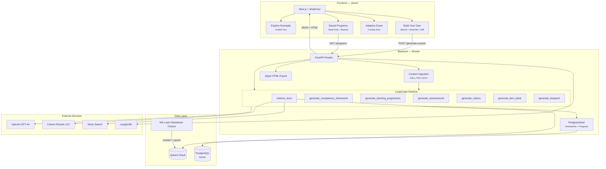
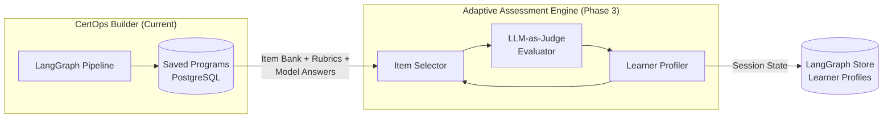

# CertOps

**AI-Native Certification Builder for Enterprise AI Platforms**

CertOps is an LLM-powered system that ingests platform documentation (or user-provided content), retrieves relevant material via RAG, and generates production-ready certification artifacts — competency frameworks, learning progressions, performance-based assessments, scoring rubrics, item banks, and certification blueprints.

**[Live Demo](https://certops.vercel.app)** | **[Loom Video](https://www.loom.com/share/e1309d309c5940098a2b80b2c843170a)**

---

## The Problem

Enterprise AI adoption efforts struggle to create up-to-date, role-specific, competency-based learning paths because official documentation is fragmented, rapidly evolving, and difficult to operationalize into structured certification programs.

As a Senior AI Enablement Manager, I am responsible for driving Microsoft 365 Copilot adoption across the organization. However, Microsoft's official learning materials and technical documentation are distributed across multiple sources, including documentation hubs, training paths, blog posts, and release notes. This fragmentation makes it difficult to determine which content is current, authoritative, and aligned with our governance standards.

At the same time, we need differentiated AI fluency tracks for everyday users, AI champions, and technical builders. Existing certifications and learning paths are either too generic or quickly become outdated as the product evolves. This leads to inconsistent adoption, unclear competency benchmarks, and significant manual effort to maintain enablement programs. We need a structured, AI-native system that transforms curated documentation into dynamic learning paths and competency-based assessments tailored to our organization.

## The Solution

CertOps is an agentic RAG application built with LangGraph. It offers four modes through a Next.js dashboard:

1. **Explore Exemplar** — Browse pre-built certifications (AI Champion, M365 Copilot User) with an interactive guided tour that walks through every artifact
2. **Build Your Own** — Upload URLs, PDFs, or DOCX files and CertOps generates a complete certification package from your content. Edit any artifact with form-based editors and LangGraph replays downstream artifacts automatically (Express Mode).
3. **Saved Programs** — Browse, view, download HTML reports, and manage previously generated certifications. Saved artifacts are pipeline-validated and internally consistent.
4. **Adaptive Exam** *(Coming Soon)* — A second LangGraph agent that delivers adaptive assessments using the generated item banks and rubrics.

The generation pipeline:

1. **Retrieve** relevant documentation chunks from Qdrant (Cohere-reranked) or ingest user-provided content (URLs, PDF, DOCX)
2. **Augment** with Tavily web search for the latest platform updates
3. **Generate** each certification artifact in sequence — framework first (so downstream artifacts can reference it), then learning progression, assessments, rubrics, item bank, and certification blueprint

Every LLM call uses OpenAI GPT-4o with structured output (Pydantic models) to ensure artifacts are valid and exportable. The final output is a comprehensive, styled HTML certification report that a non-technical user can download and hand to stakeholders.

## Architecture


```mermaid
flowchart TB
    subgraph frontend ["Frontend — Vercel"]
        NextJS["Next.js + shadcn/ui"]
        Exemplar["Explore Exemplar<br/><small>Guided Tour</small>"]
        Build["Build Your Own<br/><small>Upload + Generate + Edit</small>"]
        Saved["Saved Programs<br/><small>Read-Only + Reports</small>"]
        Assess["Adaptive Exam<br/><small>Coming Soon</small>"]
    end

    subgraph backend ["Backend — Render"]
        API["FastAPI Routes"]
        Ingest["Content Ingestion<br/><small>URLs, PDF, DOCX</small>"]
        subgraph pipeline ["LangGraph Pipeline"]
            Retrieve["retrieve_docs"]
            Framework["generate_competency_framework"]
            Progression["generate_learning_progression"]
            Assessments["generate_assessments"]
            Rubrics["generate_rubrics"]
            ItemBank["generate_item_bank"]
            Blueprint["generate_blueprint"]
        end
        Checkpointer["PostgresSaver<br/><small>Checkpoints + Programs</small>"]
        Templates["Jinja2 HTML Export"]
    end

    subgraph data ["Data Layer"]
        Qdrant[("Qdrant Cloud")]
        Postgres[("PostgreSQL<br/><small>Render</small>")]
        Corpus["MS Learn Markdown Corpus"]
    end

    subgraph services ["External Services"]
        OpenAI["OpenAI GPT-4o"]
        Cohere["Cohere Rerank v3.5"]
        Tavily["Tavily Search"]
        LangSmith["LangSmith"]
    end

    NextJS --> Exemplar & Build & Saved & Assess
    Build -->|"POST /generate-custom"| API
    Saved -->|"GET /programs"| API
    API -->|"JSON + HTML"| NextJS
    API --> Ingest --> pipeline
    API --> pipeline
    Retrieve --> Qdrant
    Retrieve --> Cohere
    Retrieve --> Tavily
    pipeline --> OpenAI
    pipeline --> Checkpointer --> Postgres
    Corpus -->|"embed + upsert"| Qdrant
    API --> LangSmith
    API --> Templates
```

## Tech Stack

| Component | Choice | Why |
|-----------|--------|-----|
| **LLM** | OpenAI GPT-4o | Best-in-class structured output via `with_structured_output()` |
| **Orchestration** | LangGraph | Stateful graph with checkpointing enables Express Mode editing and selective replay |
| **Embeddings** | OpenAI text-embedding-3-small | High quality at low cost; 1536-dim vectors |
| **Vector DB** | Qdrant Cloud | Production-grade managed vector DB with metadata filtering |
| **Retriever** | Cohere Rerank v3.5 | Winner from RAGAS evaluation — retrieve top 20, rerank to top 5 |
| **Search Tool** | Tavily | Purpose-built for AI apps; fetches latest platform updates not in the local corpus |
| **Checkpointer** | PostgresSaver (Render PostgreSQL) | Persistent graph state for Express Mode `update_state()` and selective replay |
| **Monitoring** | LangSmith | Full tracing of every LLM call, retrieval, and tool use |
| **Evaluation** | RAGAS | Measures faithfulness, context precision, and context recall |
| **Frontend** | Next.js 16 + React 19 + Tailwind + shadcn/ui + Motion | Polished dashboard with animated pipeline progress and guided tour |
| **Backend** | FastAPI + Jinja2 | Python API with HTML report rendering and programs CRUD |
| **Deployment** | Vercel (frontend) + Render (backend + PostgreSQL) | Auto-deploy from GitHub |
| **Dependencies** | uv | Fast, reproducible Python dependency management |

## Certification Tracks

CertOps ships with two exemplar tracks built from a curated corpus of 45 Microsoft Learn training module pages:

**AI Champion** — For professionals building AI agents with Copilot Studio (25 pages).

| Domain | Example Skills |
|--------|---------------|
| Agent Creation & Configuration | Agent setup, action configuration, trigger management |
| Conversational Design | Intent definition, response design, topic management |
| Connectors & Integrations | Channel deployment, system integration, API utilization |
| Security & Governance | Authentication management, data privacy, performance monitoring |

**M365 Copilot User** — For everyday users leveraging Copilot across Word, Excel, PowerPoint, Teams, and Outlook (20 pages).

| Domain | Example Skills |
|--------|---------------|
| Productivity Tools | Word processing, Excel data management, PowerPoint design |
| Communication Tools | Teams collaboration, Outlook email management |
| Data Analysis | Data insights generation, advanced reasoning with Copilot |
| Prompting Best Practices | Effective prompt creation, custom agent utilization |

> Domain names are representative — the LLM generates professional labels each run, but `TRACK_DOMAIN_HINTS` ensure the same four areas are always covered.

**Build Your Own** — Upload any combination of URLs, PDFs, and DOCX files to generate a custom certification for any topic.

## What It Generates

Each pipeline run produces six structured artifacts:

| Artifact | Description |
|----------|-------------|
| **Competency Framework** | Domains, skills, and proficiency levels (novice / competent / expert) with behavioral indicators |
| **Learning Progression** | Ordered learning objectives with suggested activities, estimated hours, and success criteria |
| **Assessment Tasks** | Scenario-based performance assessments with instructions, expected outputs, and evaluator guides |
| **Scoring Rubrics** | Weighted criteria with multi-level descriptors for consistent grading |
| **Item Bank** | Reusable assessment items (performance, scenario, analysis) with model answers and scoring notes |
| **Certification Blueprint** | Executive summary tying all artifacts together — program overview, assessment strategy, estimated duration |

All artifacts are delivered as a single downloadable HTML certification report styled for print and screen.

## Human-in-the-Loop: Express Mode

CertOps implements **Express Mode** for human-in-the-loop review, powered by LangGraph checkpointing:

1. The pipeline runs to completion without interruption
2. The certification architect reviews all six artifacts through form-based editors
3. To edit an artifact, they pick a section (e.g., a specific domain in the framework), modify it through structured form fields, and submit
4. CertOps calls `update_state()` to inject the edit at the corresponding checkpoint, then re-invokes the graph — only downstream artifacts regenerate
5. The architect can repeat until satisfied, then save the finalized program

This approach gives architects the full picture before making changes, avoids decision fatigue from step-by-step approval, and ensures internal consistency across all artifacts.

## Portfolio Notebooks

The `notebooks/` directory contains four notebooks that walk through the full engineering process:

| Notebook | What It Covers |
|----------|---------------|
| **01_data_pipeline** | Document scraping from Microsoft Learn, chunking with `RecursiveCharacterTextSplitter`, embedding with `text-embedding-3-small`, upserting to Qdrant with domain/audience metadata |
| **02_retrieval_evaluation** | Synthetic test set generation (RAGAS SDG), baseline retriever evaluation, Cohere reranker, domain-filtered retriever, full RAGAS comparison table |
| **03_certification_engine** | Pydantic schemas, LangGraph node definitions, complete `StateGraph` pipeline, end-to-end runs for both tracks |
| **04_express_mode** | LangGraph checkpointing with `MemorySaver`, full pipeline without pauses, selective editing via `update_state()`, downstream replay, comparison of original vs. edited artifacts — the pattern used in production |

## Quickstart

### Prerequisites

- Python 3.11+ with [uv](https://docs.astral.sh/uv/)
- Node.js 18+
- API keys: OpenAI, Qdrant Cloud, Cohere, Tavily, LangSmith

### Backend

```bash
# Install Python dependencies
uv sync

# Configure environment
cp .env.example .env
# Fill in your API keys in .env

# Start the FastAPI server
uv run uvicorn backend.main:app --reload --port 8000
```

### Frontend

```bash
cd frontend

# Install Node dependencies
npm install

# Create .env.local
echo "NEXT_PUBLIC_API_URL=http://localhost:8000" > .env.local

# Start the dev server
npm run dev
```

Open [http://localhost:3000](http://localhost:3000) to access the four-mode landing page.

### Running the Notebooks

```bash
# Launch Jupyter
uv run jupyter notebook

# Open notebooks/ and run 01 → 02 → 03 → 04 in order
```

## Deployment

| Service | Platform | URL |
|---------|----------|-----|
| **Frontend** | Vercel | [certops.vercel.app](https://certops.vercel.app) |
| **Backend** | Render | [certops.onrender.com](https://certops.onrender.com) |
| **Database** | Render PostgreSQL | Checkpoints + saved programs |
| **Vector DB** | Qdrant Cloud | Collection `certops_docs` with payload indexes on `metadata.domain` and `metadata.audience` |

The frontend auto-deploys from `main` via Vercel (root directory: `frontend`). The backend auto-deploys via Render using the project's `Dockerfile`.

## Screenshots

### LangSmith Tracing


### Qdrant Collection


## Project Structure

```
CertOps/
├── backend/                  # FastAPI application
│   ├── graph.py              # LangGraph pipeline (7 nodes) + PostgresSaver checkpointer
│   ├── main.py               # API endpoints, programs CRUD, HTML export
│   ├── schemas.py            # Pydantic models for all artifacts
│   ├── ingest.py             # URL fetching, PDF/DOCX parsing, text chunking
│   └── templates/
│       └── certification_report.html
├── data/
│   ├── certops_ai_champion_output.json
│   ├── certops_user_output.json
│   ├── synthetic_testset.csv
│   ├── programs/             # File-based program storage (local dev fallback)
│   └── docs/                 # Scraped Microsoft Learn markdown
├── frontend/                 # Next.js dashboard
│   ├── src/app/              # Pages (home, exemplar, create, saved, generate)
│   ├── src/components/       # UI components (artifact tabs, form editor, guided tour, results view)
│   └── src/lib/              # Types, API client, utils
├── notebooks/
│   ├── 01_data_pipeline.ipynb
│   ├── 02_retrieval_evaluation.ipynb
│   ├── 03_certification_engine.ipynb
│   └── 04_express_mode.ipynb
├── Dockerfile
├── docker-compose.yml        # Local Qdrant
├── pyproject.toml
└── uv.lock
```

## Future Work: Adaptive Assessment Engine (Phase 3)

The fourth card on the CertOps landing page — **Adaptive Exam** — is a placeholder for a second LangGraph agent that will consume the saved certification artifacts to deliver adaptive assessments in real time.

### Planned Architecture


```mermaid
flowchart LR
    subgraph CertOps ["CertOps Builder (Current)"]
        Pipeline["LangGraph Pipeline"]
        DB[("Saved Programs<br/>PostgreSQL")]
        Pipeline --> DB
    end

    subgraph AdaptiveEngine ["Adaptive Assessment Engine (Phase 3)"]
        Selector["Item Selector"]
        Evaluator["LLM-as-Judge<br/>Evaluator"]
        Profiler["Learner Profiler"]
        Selector --> Evaluator --> Profiler --> Selector
    end

    DB -->|"Item Bank + Rubrics +<br/>Model Answers"| Selector
    Profiler -->|"Session State"| Store[("LangGraph Store<br/>Learner Profiles")]
```

**How it works:**

1. **Item Selection** — The engine loads the item bank from a saved program and selects an initial question based on the learner's current estimated proficiency level.
2. **Response Evaluation** — Free-text learner responses are evaluated against the rubrics and model answers using an LLM-as-judge pattern. The rubric's weighted criteria provide consistent, explainable scoring.
3. **Adaptive Routing** — Based on the evaluation, the engine updates the learner's proficiency estimate and selects the next item. High performers get harder items; struggling learners get scaffolded questions targeting their weakest domains.
4. **Session Persistence** — LangGraph checkpointing manages in-session state. Long-term learner profiles persist in a LangGraph Store keyed by user ID, enabling the system to resume across sessions.
5. **Copilot Studio Integration** — The adaptive engine is designed as the backend for a future Copilot Studio agent, bringing the assessment experience into Microsoft Teams where learners already work.

All the structured artifacts CertOps already generates — item bank with model answers, rubrics with weighted criteria, proficiency levels with behavioral indicators — serve as the evaluation backbone for this engine.
